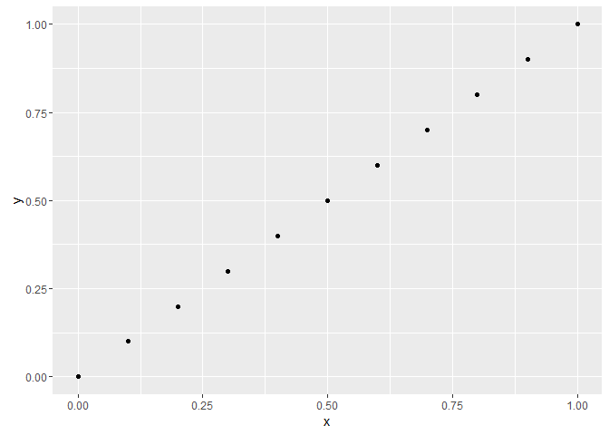

Erste Ãœberschrift
==================

-   Liste
-   Liste
-   Liste

<!-- -->

    library(ggplot2)

    x <- seq(0, 1, by = .1)
    y <- seq(0, 1, by = .1)

    ggplot(NULL, aes(x = x, y = y)) +
      geom_point()

